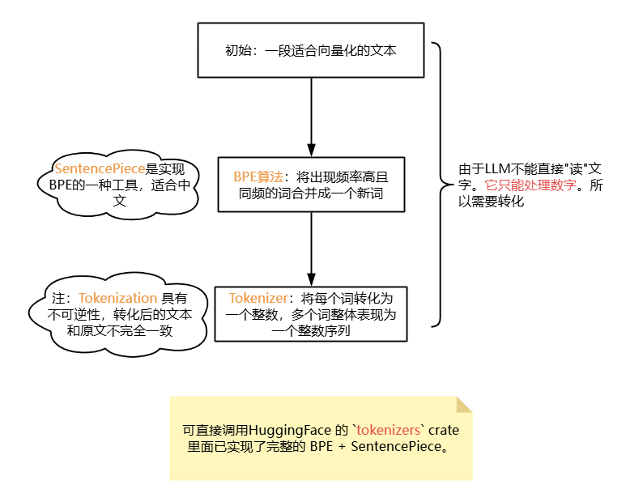
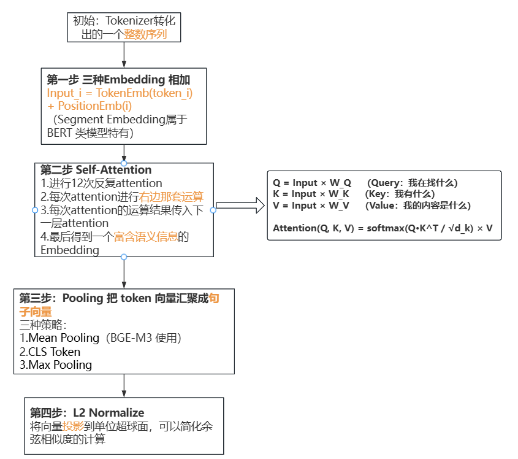
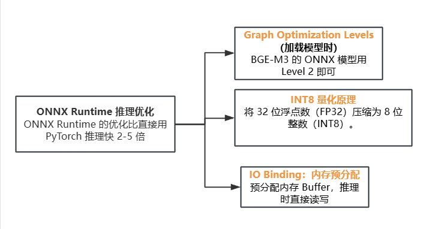

# RAG实战-lesson01-个人任务

## 1.原理图

### 1.1 Tokenizer — 文本怎么变成数字

### 1.2 Transformer Embedding — Token 向量怎么变成句子向量

### 1.3 ONNX Runtime 推理优化

## 2.核心问题文字解答

**1.BGE-M3 的 Position Embedding 最大支持 8192 个 token。如果一篇标书的条款超过这个长度会发生什么？怎么处理长文本？（提示：想想 Chunking 和位置编码的扩展方案，如 RoPE 的 extrapolation）**

解答：

（1）如果超出，那么超出部分就会被截断，导致长文本后半部分信息丢失，影响语义完整性；同时位置编码会越界，会导致模型无法正确获取位置信息，进而使注意力机制失效，输出不可靠的结果。

（2）可以通过Chunking方案解决，将长文本按一定不超过8192的长度分成多个文本块，并对每个 chunk 分别进行编码，得到多个向量；或者使用位置编码的扩展方案，如 RoPE 的 extrapolation是通过插值或外推来适应更长序列。

**2.你对比了 Mean/CLS/Max Pooling。在标书检索场景下，哪种可能最好？为什么？（提示：标书条款的关键差异往往在几个关键词上——"必须"vs"宜"、"二级"vs"一级"）**

解答：

​	Max Pooling可能最好。因为标书条款的关键差异往往在几个关键词上，Max Pooling 则会选取每个特征维度上的最大值，即那些具有强烈语义信号的关键词，如必须，一级等。

​	

**3.INT8 量化在 1024 维向量上精度损失 < 0.5%。如果维度是 128，损失会变大还是变小？为什么？（提示：大数定律——维度越多，量化误差越分散）**

解答：

​	变大。因为大数定律是维度越少，量化误差越集中，这就会导致单个维度的误差对向量整体方向和模长的影响更大，从而导致检索精度下降。