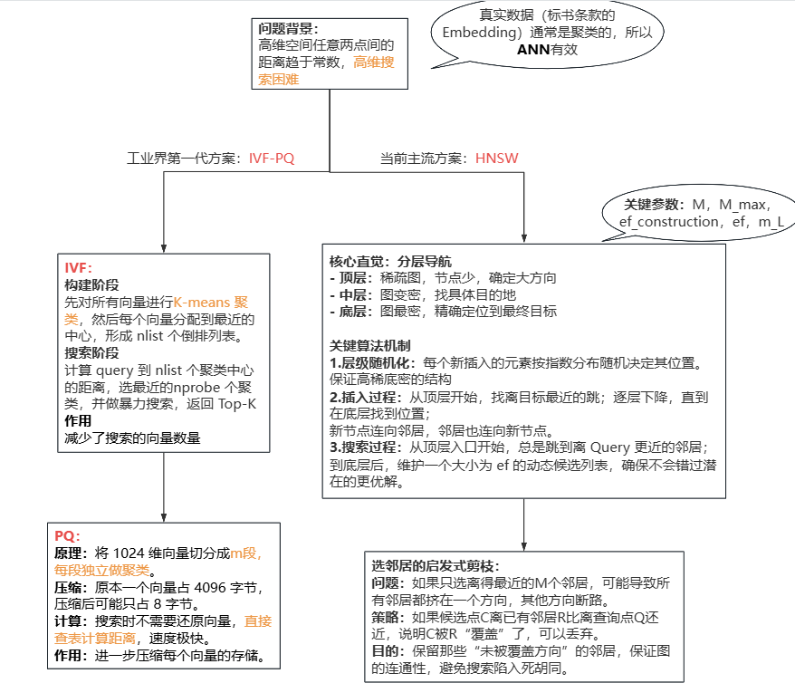

# RAG实战-lesson02-个人任务

## 1.原理图

### 

## 2.核心问题文字解答

**1.`select_neighbors` 的启发式剪枝中，"if `dist(c, existing) < dist(c, q)`" 这个条件直觉上很奇怪——它保留了"离已有邻居比离 query 更近"的候选。为什么这样能保证图的连通性？**

解答：

​	因为主要是为了去掉冗余并确保能去找不同的方向。假设一个候选点 a离已有的邻居b比查询点q还近，说明a和b在空间上几乎重叠，b已经能代表这个方向了。再连接a就是多余的；然后通过刚才的规则就能剔除掉冗余的候选点，算法就会被强制去寻找那些离所有已有邻居都很远的点，即确保不同方向。这样能确保一个节点的邻居们能均匀地分布在它周围，覆盖各个方向，从而保证图的连通性。

**2.HNSW 论文发表已经 9 年了。它有什么已知缺陷？最新的替代方案（如 DiskANN、FreshDiskANN）在什么场景下优于 HNSW？**

解答：

​	HNSW的缺陷主要是内存占用大，因为需要很多邻居指针，同时由于搜索路径是随机的，会产生大量随机IO，对磁盘不友好。

​	在数据量大并且内存有限的场景有优势。

**3.如果 100K 数据每天新增 1K 条，HNSW 的增量插入会导致图质量退化吗？你怎么检测退化？**

​	会。因为新插入的点只能连接现有节点，无法改变旧节点之间的连接。随着时间推移，图的全局结构会逐渐无法适应新的数据分布，导致召回率下降。

​	可以维护一组固定的查询及其标准答案，定期用这组查询在当前索引上测试召回率，如果召回率持续下降，就说明图质量已退化。